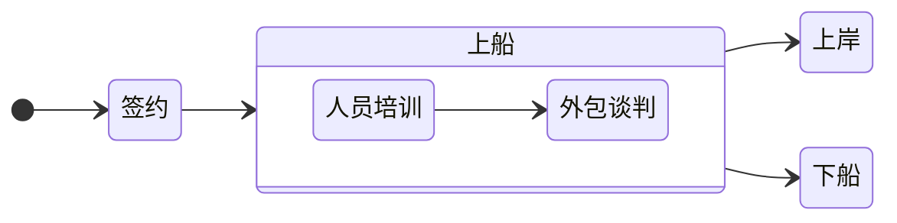

# 中介公司 Staffing Company

不生产工作机会，只是工作信息的搬运工

[[toc]]

## 从上船到下船

## 中介公司信息模板 Template

创建新页面时请复制粘贴下面的模板代码。

### 公司信息
| 信息类别     | 具体内容                           |
|----------|--------------------------------|
| **公司名称** | ABC Staffing Solutions         |
| **成立时间** | 2024 年                         |
| **公司电话** | 123-456-7890                   |
| **公司邮箱** | contact@abcstaffing.com        |
| **公司地址** | 123 Main St, NY                |
| **公司官网** |                                |
| **运输岗位** | 合同工                            |
| **行业领域** | IT、金融、制造、医疗                    |
| **在美身份支持** | Opt / Opt Ext / H1B            |
| **工资单支持** | 不支持                            |
| **招聘流程** | 简历筛选 → 初步面试 → 客户面试 → 外包员工上岸新公司 |

### 人力资源专员 Recruiter/HR

| **名字** | **邮箱** | **微信号** | **领英** | **小红书** |
|--------|--------|---------|--------|---------|
|        |        |         |        |         |

### 上船待遇

#### 人员培训 training

| 信息类别     | 具体内容 |
|----------|------|
| **培训内容** |      |
| **时长**   |      |
| **收费情况** |      |
| **可以远程** |      |

#### 外包谈判 marketing

| 信息类别     | 具体内容 |
|----------|------|
| **持续时长** |      |
| **预期准备** |      |
| **收费情况** |      |
| **可以远程** |      |

### 下船待遇

#### 上岸

#### 主动退出

#### 被动退出

### 航海日志

#### 2024年11月

在微信群发布了招聘信息