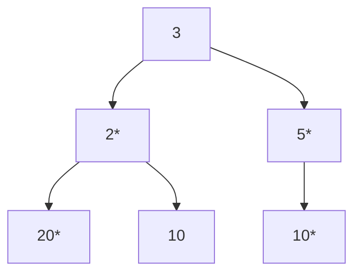

# DoorDash 电面面经

题目和 [LeetCode 124](https://leetcode.com/problems/binary-tree-maximum-path-sum/) 很像，但不完全一样，因为 path 必须要以 alive 的节点作为起始和终点。

## 面试题目描述

### 第一问
假设所有 leaf nodes（叶子节点）都是 alive 节点。

### 第二问
任意节点都可能是 alive 节点。

## 示例

带星号的节点为 alive：

对于上图这个树而言，第二问的最大结果是22。