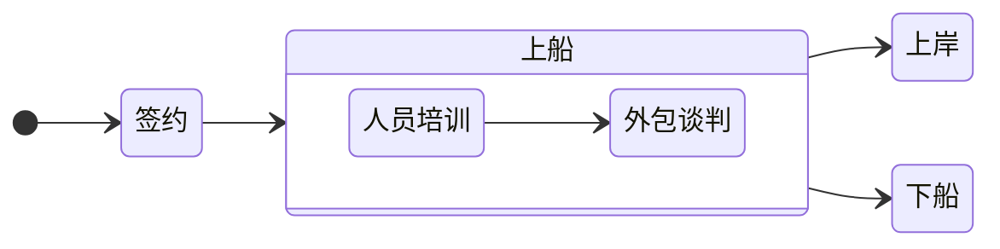

# Staffing Company劳务派遣公司的运作方式

不生产工作机会，只是工作信息的搬运工

[[toc]]

## 从上船到下船

## C2C 例子

> [!CAUTION] 警惕下面的例子
> 原笔记已经在小某书上被封，说明触犯了某些法律法规，大家可以参考一下，看看哪些地方不对劲

首先介绍一下一个新的模式：C2C，也叫 corp to corp，可以理解为：你的公司（简称 S），与 staffing 公司，比如我们（简称 A），以及雇员，也就是你自己，签订三方合同📖，S 公司出一笔钱 💰，而你的 sponsor/保险/401k/PTO 等 package，由 A 公司来负责，也可以理解为，你是 A 公司派到 S 公司的 consultant 😄，S 公司付钱，A 公司出人！

首先，公司不能 sponsor，可以是多种原因的：budget 有限，裁员过多，或没有经验等，非不想也，是不能也 😭 那么我们是怎么帮助大家抽 H1b 办 🟢 卡的呢～

👉 情况 1：已经有 offer 且工作了的同学，这种情况，我们会建议先跟公司确定一下你现在这个岗位能否转成 contractor 岗，💬 然后告知公司你有自己的 staffing 公司愿意 sponsor，公司正常付工资就好，其他的 staffing 公司帮你搞定的 staffing 公司帮你搞定，然后拉一个会，我们谈一下三方的合作待遇，如果都没有异议，就可以走 C2C 了

Hint：一般转成 contract 岗位后雇主反而会多付钱 😄，因为不需要他们担心保险/401k/税等问题了，我们会帮助大家跟雇主要多一点的 💰

👉 情况 2：正在求职还没有拿到 offer 的同学，在投递简历阶段，就开始选择不需要 sponsor！拿到面试后告知 HR 自己有 staffing 公司去 sponsor 自己，确定这个岗位是否可以是 contract 岗位，如果可以且面试通过，一样的流程，拉会议沟通 C2C 合作细节

Hint：有些大胆的学生直接说，这个 staffing 公司是自己朋友的公司 / 自己有股份在，🧓再搭配自己优秀的面试表现，说服公司并成功拿到 offer！

🌟 总结一下，C2C 就是找第三方帮你搞定身份问题，而你需要做的就是表现的足够优秀，让不能给你 sponsor 的公司可以配合你～

🌟 C2C 成功几率很大，因为雇主省钱，我们可以赚取 5%-20% 的佣金，雇员可以拿到身份，三赢！

🧑‍💼 sponsor 身份确实是个大问题，所以有需要帮助的么 🧑‍💼 ASCENDING 可以哦～

